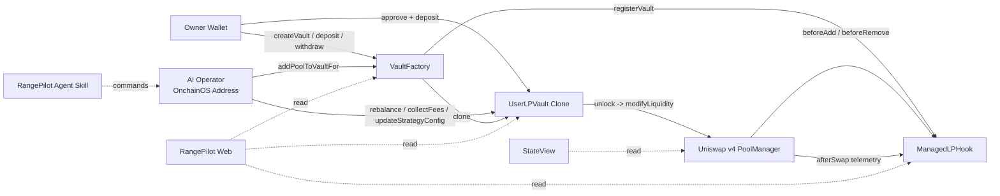
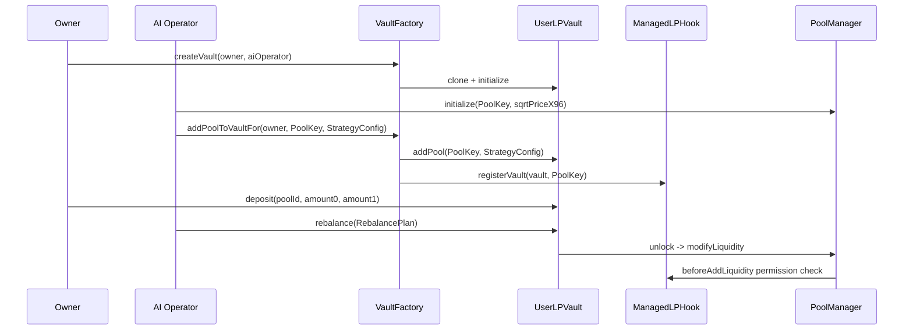

# RangePilot

<p align="center">
  <strong>AI-managed Uniswap v4 LP Vaults on X Layer</strong>
  <br />
  <sub>Built with OKX OnchainOS, RangePilot Vaults, and ManagedLPHook</sub>
  <br />
  <br />
  <a href="https://www.rangepilot.xyz">Web App</a>
  ·
  <a href="./README_zh.md">中文</a>
</p>

## Table Of Contents

| Section | What It Covers |
|---|---|
| [Overview](#overview) | RangePilot's positioning, core idea, and user fund boundaries |
| [Problems](#problems) | Concentrated liquidity complexity, AI execution boundaries, multi-pool management, and Hook pool workflows |
| [Solution](#solution) | How Hook, Vault, and Factory work together |
| [Architecture](#architecture) | Protocol component diagram and lifecycle from Vault creation to rebalance |
| [Core Contracts](#core-contracts) | Main contract responsibilities and owner / AI operator permissions |
| [Quickstart](#quickstart) | Install the RangePilot skill, create a Vault, and manage LP through AI prompts |
| [Deployments](#deployments) | X Layer Mainnet / Testnet contract addresses and Explorer links |
| [Security Model](#security-model) | Vault custody, Hook access control, multi-pool isolation, and risk checks |
| [Roadmap](#roadmap) | Short-term plan |
| [Repository](#repository) | Monorepo structure |
| [License](#license) | Project license |
| [Disclaimer](#disclaimer) | Risk notice |

---

## Overview

RangePilot is an AI LP management protocol built around the Uniswap v4 Hook model. It separates user fund custody from AI strategy execution:

- Each user owns a `UserLPVault`.
- A Vault can bind multiple Uniswap v4 pools.
- Each pool has independent idle balances, active LP range, strategy config, and nonce.
- AI uses [OKX OnchainOS](https://github.com/okx/onchainos-skills) to help users create/bind pools, adjust LP ranges, collect fees, and update strategy parameters.
- Withdrawals, emergency exits, and AI operator changes remain under owner control.

RangePilot uses OKX OnchainOS as the AI execution layer. Users create a Vault in the Web app and set an OnchainOS EVM address as `AI Operator`; then AI can submit security-scanned contract calls through OnchainOS, such as binding Hook pools, reading Vault state, and generating/executing rebalances.

User funds always stay inside the user's own Vault. OnchainOS handles wallet execution, transaction sending, and safety checks, while RangePilot contracts restrict AI actions to the owner-authorized LP management boundary.

## Problems

Uniswap v4 Hooks make pool logic extensible, but normal users still face several barriers:

1. **Concentrated liquidity is complex**
   Users need to understand ticks, ranges, prices, token ratios, slippage, fees, and rebalance timing.

2. **AI can suggest actions, but needs safe execution boundaries**
   Giving an automated system private keys or unlimited approvals is too risky.

3. **Multi-pool management is messy**
   Balances, nonces, and active positions must be isolated across pools.

4. **Custom Hook pool operations are fragmented**
   Pool creation, Hook binding, deposits, rebalance, and state checks often require multiple tools.

RangePilot is designed so AI can execute, but only through Vaults; users can authorize AI, but keep exit rights.

---

## Solution

RangePilot uses three layers:

| Layer | Component | Role |
|---|---|---|
| Hook | `ManagedLPHook` | Allows add/remove liquidity only from registered Vaults and records swap telemetry |
| Vault | `UserLPVault` | Holds user funds, accounts by poolId, and executes deposit/rebalance/collect/withdraw |
| Factory | `VaultFactory` | Creates one Vault per owner and registers pools with both Vault and Hook |

AI agents use OKX OnchainOS for security scans and transaction sending, and Foundry `cast` for calldata encoding, state reads, and transaction simulation.

---

## Architecture



### Lifecycle



---

## Core Contracts

| Contract | Path | Description |
|---|---|---|
| `ManagedLPHook` | `packages/contracts/src/ManagedLPHook.sol` | Uniswap v4 Hook. Checks whether the Vault is registered, restricts add/remove liquidity, and records swap telemetry |
| `VaultFactory` | `packages/contracts/src/VaultFactory.sol` | Creates user Vault clones; supports owner or aiOperator binding pools to an existing Vault |
| `UserLPVault` | `packages/contracts/src/UserLPVault.sol` | User fund Vault. Supports multi-pool subaccounts, deposit, rebalance, collect, and withdraw |

### Permission Summary

| Action | owner | aiOperator | Other |
|---|---:|---:|---:|
| Create Vault | yes | no | no |
| Bind pool to Vault | yes | yes | no |
| deposit | yes | no | no |
| rebalance | yes | yes | no |
| collectFees | yes | yes | no |
| updateStrategyConfig | yes | yes | no |
| withdraw / emergencyExit | yes | no | no |
| updateAIOperator / revokeAIOperator | yes | no | no |

---

## Quickstart

The recommended RangePilot workflow is to install the project skill, then interact with an AI agent that supports skills. Users do not need to manually build calldata or memorize Uniswap v4 internals; they can tell the AI what they want to do with their Vault and LP positions.

### 1. Install RangePilot Skill

```bash
npx skills add https://github.com/RangePilot/RangePilot
```

After installation, the AI can read RangePilot's project description, deployment addresses, contract interfaces, OnchainOS workflow, and risk controls.

### 2. Create Your Vault

Get your OnchainOS EVM address:

```bash
onchainos wallet addresses --chain xlayer
```

Then visit:

```text
https://www.rangepilot.xyz
```

Connect your wallet, create a Vault, and enter your OnchainOS EVM address as `AI Operator`. After the Vault is created, AI can help bind pools, read state, and execute rebalance within your authorization. deposit and withdraw still require the owner wallet.

### 3. Start Talking To AI

Example prompts:

```text
Show me my RangePilot Vault status on X Layer.
```

```text
This is my Vault address: 0x... Please check owner, AI Operator, bound pools, and current LP positions.
```

```text
Create a Uniswap v4 pool with the RangePilot hook for <TokenA> / <TokenB>.
```

```text
Bind this pool to my Vault: 0x...
```

```text
I deposited 5 <TokenA> and 200000 <TokenB>. Add an LP position around the current price with a +/- <x> tick range.
```

```text
Check whether my current position is drifting out of range. If needed, generate and execute a rebalance.
```

---

## Deployments

### X Layer Mainnet

| Component | Address |
|---|---|
| Chain ID | `196` |
| ManagedLPHook | [`0x29779a886523edEE78187f051635F7A969DC8a40`](https://www.okx.com/web3/explorer/xlayer/address/0x29779a886523edEE78187f051635F7A969DC8a40) |
| UserLPVault implementation | [`0x8Aa7b9869Bf6E3566070395bFaE367Ad914BA9e4`](https://www.okx.com/web3/explorer/xlayer/address/0x8Aa7b9869Bf6E3566070395bFaE367Ad914BA9e4) |
| VaultFactory | [`0xE8c006b5d4A8a2b0CC886c947a8Fd5F1E0eB921A`](https://www.okx.com/web3/explorer/xlayer/address/0xE8c006b5d4A8a2b0CC886c947a8Fd5F1E0eB921A) |

### X Layer Testnet

| Component | Address |
|---|---|
| Chain ID | `1952` |
| UniSwap PoolManager | [`0x6df5DAE1e6216578e9eC63b239BFa6990AE6ed50`](https://www.okx.com/web3/explorer/xlayer-test/address/0x6df5DAE1e6216578e9eC63b239BFa6990AE6ed50) |
| UniSwap StateView | [`0x1cf2f6b229E313bAC1174F9e6c6a5Cd567F07F3E`](https://www.okx.com/web3/explorer/xlayer-test/address/0x1cf2f6b229E313bAC1174F9e6c6a5Cd567F07F3E) |
| ManagedLPHook | [`0x483744FA9563EFaC32a3C7c73AfeBEFA55418a40`](https://www.okx.com/web3/explorer/xlayer-test/address/0x483744FA9563EFaC32a3C7c73AfeBEFA55418a40) |
| UserLPVault implementation | [`0x2Bbc43C6409C7b203670630283139C25cB89358e`](https://www.okx.com/web3/explorer/xlayer-test/address/0x2Bbc43C6409C7b203670630283139C25cB89358e) |
| VaultFactory | [`0x9f05221D3E653EC21911F4d91b3054A0E54027C6`](https://www.okx.com/web3/explorer/xlayer-test/address/0x9f05221D3E653EC21911F4d91b3054A0E54027C6) |

---

## Security Model

RangePilot's security model is built around minimal authorization and verifiable on-chain boundaries.

### Vault Custody

User tokens are deposited into the user's own Vault. The AI operator does not receive tokens and cannot withdraw.

### Hook-Gated LP Modification

`ManagedLPHook` allows only registered Vaults to add/remove liquidity for the corresponding pool. Direct liquidity modification from non-Vault addresses is rejected.

### Multi-Pool Balance Isolation

Vault state is keyed by `poolId`:

- idle0 / idle1
- active position
- strategy config
- nonce

Funds for one pool cannot be used for another pool.

### Rebalance Risk Controls

`StrategyConfig` limits:

- min/max tick width
- max tick movement per rebalance
- max slippage bps
- whether out-of-range positions are allowed

`RebalancePlan` limits:

- deadline
- nonce
- amount min / max
- old active liquidity must be fully removed before adding a new position

### OnchainOS Scan

The agent skill requires every write transaction to run `onchainos security tx-scan` before calling contracts through `onchainos wallet contract-call`.

---

## Roadmap

- [ ] Show richer rebalance history and Hook swap telemetry in the frontend.
- [ ] Add automated parameter calculation scripts to the agent skill.
- [ ] Support more strategy templates: stablecoin narrow range, meme wide range, and single-sided LP.
- [ ] Add a clearer strategy envelope and user confirmation layer for AI operators.
- [ ] Expand X Layer asset monitoring and pool risk alerts.

---

## Repository

```text
RangePilot/
├── packages/
│   ├── contracts/      # Foundry contracts, tests, deployment scripts
│   ├── web/            # React + Vite + wagmi frontend
│   └── skills/         # Agent skill for RangePilot + OnchainOS workflows
├── LICENSE
├── README.md
└── README_zh.md
```

---

## License

MIT License. See [LICENSE](./LICENSE).

---

## Disclaimer

RangePilot is experimental software. It is not financial advice, investment advice, or a recommendation to provide liquidity, trade, or hold any digital asset. Smart contracts and automated LP strategies can fail, and concentrated liquidity positions can lose value. Use at your own risk.
