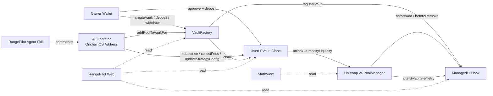
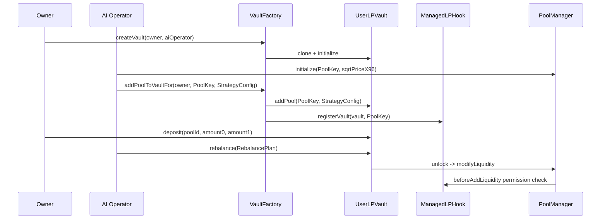

# RangePilot

## 目录

| 章节 | 内容 |
|---|---|
| [Quickstart](#quickstart) | 安装 RangePilot skill，并通过示例 prompt 和 AI 对话管理 LP |
| [项目简介](#项目简介) | RangePilot 的定位、核心理念和用户资产边界 |
| [核心问题](#核心问题) | 集中流动性、AI 执行权限、多 pool 管理和 Hook pool 操作门槛 |
| [解决方案](#解决方案) | Hook、Vault、Factory 三层架构如何协作 |
| [架构总览](#架构总览) | 协议组件关系图和从创建 Vault 到 rebalance 的生命周期 |
| [核心合约](#核心合约) | 主要合约职责与 owner / AI operator 权限摘要 |
| [当前部署](#当前部署) | X Layer Mainnet / Testnet 已部署合约地址与 Explorer 链接 |
| [安全模型](#安全模型) | Vault 资产托管、Hook 访问控制、多 pool 隔离和风控检查 |
| [路线图](#路线图) | Short Term 计划 |
| [Repository](#repository) | Monorepo 目录结构 |
| [License](#license) | 项目许可证 |
| [Disclaimer](#disclaimer) | 风险提示 |

---

## Quickstart

RangePilot 的推荐使用方式是：先安装项目 skill，然后直接和支持 skills 的 AI agent 对话。用户不需要手动拼接合约 calldata，也不需要记住 Uniswap v4 的底层参数；只需要告诉 AI 自己想创建 Vault、绑定 pool、deposit 或管理 LP 头寸。

### 1. 安装 RangePilot Skill

```bash
npx skills add https://github.com/RangePilot/RangePilot
```

安装完成后，AI 会读取 RangePilot 的项目说明、部署地址、合约接口、OnchainOS 操作流程和风控边界，并据此协助用户完成链上交互。

### 2. 创建你的 Vault

先获取你的 OnchainOS EVM 地址：

```bash
onchainos wallet addresses --chain xlayer
```

然后访问：

```text
https://www.rangepilot.xyz
```

连接钱包后创建 Vault，并把你的 OnchainOS EVM 地址填入 `AI Operator`。创建完成后，AI 就可以在你的授权范围内帮助绑定 pool、读取状态并执行 rebalance。deposit 和 withdraw 仍然需要 owner 钱包自己确认。

### 3. 开始和 AI 对话

你可以直接使用类似下面的 prompt：

```text
帮我查看我在 X Layer 上的 RangePilot Vault 状态。
```

```text
这是我的 Vault 地址：0x...，帮我检查 owner、AI Operator、已绑定的 pool 和当前 LP 头寸。
```

```text
帮我创建一个带 RangePilot hook 的 Uniswap v4 pool，交易对是 <TokenA> / <TokenB>。
```

```text
把这个 pool 绑定到我的 Vault：0x...
```

```text
我已经 deposit 了 5 <TokenA> 和 200000 <TokenB>，帮我在当前价格上下 <x> tick 添加 LP 头寸。
```

```text
帮我检查当前头寸是否偏离区间，如果需要，请生成并执行一次 rebalance。
```

---

## 项目简介

RangePilot 是一个围绕 Uniswap v4 Hook 机制构建的 AI LP 管理协议。它把「用户资金保管」和「AI 策略执行」拆开：

- 用户拥有自己的 `UserLPVault`。
- Vault 可以绑定多个 Uniswap v4 pool。
- 每个 pool 拥有独立的 idle 余额、active LP range、策略参数和 nonce。
- AI 通过 [OKX OnchainOS](https://github.com/okx/onchainos-skills) 帮助用户创建/绑定 pool、调整 LP range、收取费用、更新策略参数。
- 提款、紧急退出、修改 AI operator 仍由 owner 控制。

RangePilot 使用 OKX OnchainOS 作为 AI 的链上执行层。用户在 Web 中创建 Vault，并把 AI 的 OnchainOS EVM 地址设置为 `AI Operator`；之后 AI 可以通过 OnchainOS 发起安全扫描后的合约调用，例如绑定 Hook pool、读取 Vault 状态、生成并执行 rebalance。

用户资金始终保存在自己的 Vault 中。OnchainOS 负责钱包、交易发送和安全检查，RangePilot 合约负责限制 AI 只能在 owner 授权的范围内管理 LP。

## 核心问题

Uniswap v4 的 Hook 让 pool 逻辑可扩展，但普通用户仍然面对几个门槛：

1. **集中流动性管理复杂**
   用户需要理解 tick、range、价格、token 比例、slippage、费用和再平衡时机。

2. **AI 可以建议，但缺少安全执行边界**
   如果直接把私钥或无限授权交给自动化系统，风险过高。

3. **一用户多 pool 管理混乱**
   多个 pool 的余额、nonce、active position 需要严格隔离。

4. **自定义 Hook pool 的链上操作路径仍然碎片化**
   创建 pool、绑定 Hook、存入资金、执行 rebalance、检查状态，需要多套工具配合。

RangePilot 的设计重点是：让 AI 可以执行，但只能通过 Vault 执行；让用户可以授权，但保留退出权。

---

## 解决方案

RangePilot 引入三层结构：

| 层 | 组件 | 作用 |
|---|---|---|
| Hook 层 | `ManagedLPHook` | 限制只有已注册 Vault 可以 add/remove liquidity，并记录 swap telemetry |
| Vault 层 | `UserLPVault` | 持有用户资金，按 poolId 独立记账，执行 deposit/rebalance/collect/withdraw |
| Factory 层 | `VaultFactory` | 为 owner 创建唯一 Vault，并把 pool 注册到 Vault 与 Hook |

AI agent 使用 OKX OnchainOS 进行安全扫描和交易发送，使用 Foundry `cast` 编码 calldata、查询状态、模拟交易。

---

## 架构总览



### 生命周期



---

## 核心合约

| 合约 | 路径 | 说明 |
|---|---|---|
| `ManagedLPHook` | `packages/contracts/src/ManagedLPHook.sol` | Uniswap v4 Hook。检查 Vault 是否已注册，限制 add/remove liquidity，记录 swap telemetry |
| `VaultFactory` | `packages/contracts/src/VaultFactory.sol` | 创建用户 Vault clone；支持 owner 或 aiOperator 绑定 pool 到已有 Vault |
| `UserLPVault` | `packages/contracts/src/UserLPVault.sol` | 用户资金 Vault。支持多 pool 子账户、deposit、rebalance、collect、withdraw |

### 权限摘要

| 操作 | owner | aiOperator | 其他地址 |
|---|---:|---:|---:|
| 创建 Vault | yes | no | no |
| 绑定 pool 到 Vault | yes | yes | no |
| deposit | yes | no | no |
| rebalance | yes | yes | no |
| collectFees | yes | yes | no |
| updateStrategyConfig | yes | yes | no |
| withdraw / emergencyExit | yes | no | no |
| updateAIOperator / revokeAIOperator | yes | no | no |

## 当前部署

### X Layer Mainnet

| 组件 | 地址 |
|---|---|
| Chain ID | `196` |
| ManagedLPHook | [`0x29779a886523edEE78187f051635F7A969DC8a40`](https://www.okx.com/web3/explorer/xlayer/address/0x29779a886523edEE78187f051635F7A969DC8a40) |
| UserLPVault implementation | [`0x8Aa7b9869Bf6E3566070395bFaE367Ad914BA9e4`](https://www.okx.com/web3/explorer/xlayer/address/0x8Aa7b9869Bf6E3566070395bFaE367Ad914BA9e4) |
| VaultFactory | [`0xE8c006b5d4A8a2b0CC886c947a8Fd5F1E0eB921A`](https://www.okx.com/web3/explorer/xlayer/address/0xE8c006b5d4A8a2b0CC886c947a8Fd5F1E0eB921A) |

### X Layer Testnet

| 组件 | 地址 |
|---|---|
| Chain ID | `1952` |
| UniSwap PoolManager | [`0x6df5DAE1e6216578e9eC63b239BFa6990AE6ed50`](https://www.okx.com/web3/explorer/xlayer-test/address/0x6df5DAE1e6216578e9eC63b239BFa6990AE6ed50) |
| UniSwap StateView | [`0x1cf2f6b229E313bAC1174F9e6c6a5Cd567F07F3E`](https://www.okx.com/web3/explorer/xlayer-test/address/0x1cf2f6b229E313bAC1174F9e6c6a5Cd567F07F3E) |
| ManagedLPHook | [`0x483744FA9563EFaC32a3C7c73AfeBEFA55418a40`](https://www.okx.com/web3/explorer/xlayer-test/address/0x483744FA9563EFaC32a3C7c73AfeBEFA55418a40) |
| UserLPVault implementation | [`0x2Bbc43C6409C7b203670630283139C25cB89358e`](https://www.okx.com/web3/explorer/xlayer-test/address/0x2Bbc43C6409C7b203670630283139C25cB89358e) |
| VaultFactory | [`0x9f05221D3E653EC21911F4d91b3054A0E54027C6`](https://www.okx.com/web3/explorer/xlayer-test/address/0x9f05221D3E653EC21911F4d91b3054A0E54027C6) |

---

## 安全模型

RangePilot 的安全设计围绕「最小授权」和「链上可验证边界」：

### Vault 持有资产

用户 token 存入自己的 Vault。AI operator 不接收 token，也不能提款。

### Hook 限制 LP 修改者

`ManagedLPHook` 只允许注册过的 Vault 对对应 pool 执行 add/remove liquidity。非 Vault 地址直接修改 liquidity 会被拒绝。

### 多 pool 余额隔离

Vault 内部按 `poolId` 记录：

- idle0 / idle1
- active position
- strategy config
- nonce

一个 pool 的资金不能用于另一个 pool。

### Rebalance 风控

`StrategyConfig` 限制：

- 最小/最大 tick width
- 单次最大 tick 移动
- 最大 slippage bps
- 是否允许 out-of-range position

`RebalancePlan` 限制：

- deadline
- nonce
- amount min / max
- 必须一次性移除旧 active liquidity 后再添加新 position

### OnchainOS 扫描

Agent skill 要求每笔写交易先执行 `onchainos security tx-scan`，再用 `onchainos wallet contract-call` 调用合约。

---

## 路线图

- [ ] 在前端展示更完整的 rebalance history 和 Hook swap telemetry。
- [ ] 增强 agent skill 的自动化参数计算脚本。
- [ ] 支持更多策略模板：稳定币窄区间、meme 宽区间、single-sided LP。
- [ ] 为 AI operator 增加更清晰的策略 envelope 与用户确认层。
- [ ] 扩展 X Layer 资产监控和 pool 风险提示。

---

## Repository

```text
RangePilot/
├── packages/
│   ├── contracts/      # Foundry contracts, tests, deployment scripts
│   ├── web/            # React + Vite + wagmi frontend
│   └── skills/         # Agent skill for RangePilot + OnchainOS workflows
├── LICENSE
├── README.md
└── README_zh.md
```

---

## License

MIT License. See [LICENSE](./LICENSE).

---

## Disclaimer

RangePilot is experimental software. It is not financial advice, investment advice, or a recommendation to provide liquidity, trade, or hold any digital asset. Smart contracts and automated LP strategies can fail, and concentrated liquidity positions can lose value. Use at your own risk.
